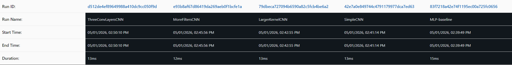
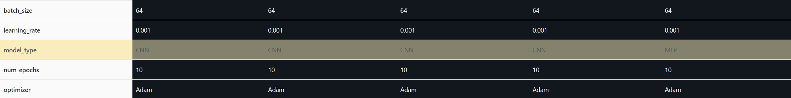
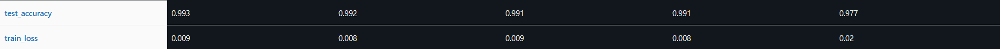

# Part 7 Lab Writeup

## MLP vs Baseline CNN

This lab compares the MLP baseline with the SimpleCNN in a controlled setting where both models use the same data pipeline and number of epochs. The MLP achieved good accuracy, but the SimpleCNN showed improvement (0.977 vs 0.991 test accuracy), which shows the advantage that convolutional models have for image tasks. By preserving spatial relationships between pixels, a CNN can learn local patterns such as edges and curves, but the MLP flattens the input and loses the structure of the images.

## Mlflow Tables

## Experiments

### Experiment 1:
For the first experiment I increased the kernel size from 3 pixels to 5 pixels. I expected this to increase the model's capacity to discover larger patterns faster. This experiment performed exactly the same as the baseline CNN. This makes sense because the kernel size really only affects the speed of the model, with larger kernels requiring more computation. A model with less layers might benefit from a larger kernel, but it seems like this model has sufficient layers even with a kernel size of 3x3. 

### Experiment 2: 
I doubled the number of filters for experiment 2. I expected this to increase the model's ability to extract high-level semantic features. The model performed slightly better (increase of 0.001 test accuracy).

### Experiment 3: 
For experiment 3 I increased the number of convolutional layers from 2 to 3. I expected a large increase in the models performance since more layers allow the model to extract higher level abstract features from the input. The model performed very slightly better (0.002 test accuracy) compared to the baseline CNN. Given that the baseline CNN is already performing so well it makes sense that no changes resulted in a significant increase in test accuracy.

## Discussion
The feature maps show that the model is mainly looking for distignuishing features that are unique to each number. For example, the feature maps for the number 7 show that the model is looking for a straight line close to the top of the image. The learned filters show that the model is primarily looking for certain types of edges like corners, straight lines, diagonal lines, curved lines, etc, to distinguish numbers. 

## Conclusion
What surprised me is how well the model does with so few layers. The models with just 2 conv layers performed very well. Another thing that surprised me is the convolution filters. It is not very obvious what they are each looking for in the image. If I had more time I would increase the number of conv layers until the models stop increasing in test accuracy. I suspect that around 5 conv layers would be the optimal number.